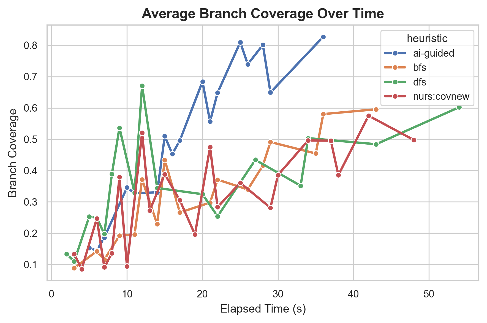

# Adaptive Symbolic Execution
### AI-Guided Search Heuristics for Symbolic Execution using Machine Learning, Large Language Models, and Reinforcement Learning

<p align="center">
  
  
  
  
  
  
</p>

---

## Overview

Adaptive Symbolic Execution is a research-oriented framework that enhances symbolic execution through AI-driven search heuristics. Instead of relying on traditional static exploration strategies such as Depth-First Search (DFS), Breadth-First Search (BFS), or Random Path Selection, the framework learns how to prioritize symbolic execution states using Machine Learning, Large Language Models (LLMs), and Reinforcement Learning.

The framework extends the KLEE symbolic execution engine and aims to maximize branch coverage while reducing redundant path exploration, constraint solving overhead, and execution time.

This project combines modern Software Engineering research with Artificial Intelligence and is designed for experimentation, reproducibility, and future academic publication.

---

# Motivation

Symbolic execution is one of the most powerful techniques for automated software testing.

Unfortunately, it suffers from one fundamental problem:

> **Path Explosion**

Large programs generate millions of execution paths, making exhaustive exploration computationally infeasible.

Traditional symbolic execution engines use handcrafted search heuristics that perform well only for certain programs.

This project investigates whether AI can automatically learn better exploration strategies.

---

# Research Objectives

The framework addresses several research questions:

- Can Machine Learning improve symbolic execution search heuristics?
- Can Large Language Models understand program semantics to guide exploration?
- Can Reinforcement Learning continuously adapt exploration strategies?
- Can AI maximize branch coverage while reducing execution cost?

---

# Key Features

- KLEE Integration
- LLVM Bitcode Support
- Automated Feature Extraction
- Machine Learning-based State Ranking
- Reinforcement Learning Search Policies
- LLM-assisted Program Analysis
- Branch Coverage Optimization
- Interactive Experiment Dashboard
- Statistical Evaluation
- Docker-based Reproducible Environment
- Publication-ready Results

---

# Architecture

```text
C Program
      │
      ▼
LLVM Bitcode
      │
      ▼
KLEE Symbolic Execution
      │
      ▼
Execution States
      │
      ▼
Feature Extraction
      │
      ├───────────────┐
      ▼               ▼
Machine Learning   LLM Analysis
      │               │
      └──────┬────────┘
             ▼
 Reinforcement Learning
             ▼
 Priority Ranking
             ▼
 Next State Selection
             ▼
 Improved Branch Coverage
```

---

# Repository Structure

```text
Adaptive-Symbolic-Execution/
├── backend/                   # KLEE Harness & Core Pydantic Schemas
│   ├── api/
│   ├── core/
│   └── services/
├── klee/                      # Core symbolic engine configurations
├── llvm/                      # LLVM IR extractors
├── feature_extractor/         # AST and Execution Depth Extractors
├── models/                    # ML and RL Architectures
│   ├── ml/
│   └── rl/
├── reinforcement_learning/    # PPO/DQN agents and environments
├── llm/                       # Prompt strategies and context handlers
├── dashboard/                 # Streamlit Real-Time Visualizer
├── evaluation/                # Benchmark Orchestrator & Stats Engine
├── experiments/               # Saved benchmark runs
├── dataset/                   # Coreutils and testing bitcode
├── visualization/             # Plotting utilities
├── docs/                      # Phase-by-Phase Developer Notes
├── tests/                     # Pytest suite validating all modules
├── Docker/                    # Docker containerization orchestrators
├── configs/                   # Hyperparameters
├── paper/                     # Generated LaTeX tables and PDF plots
└── scripts/                   # CLI Entry points
```

---

# Project Pipeline

### Phase 1: Environment Setup
- Python
- LLVM
- KLEE
- Docker

---

### Phase 2: Run Symbolic Execution
- Compile C programs
- Generate LLVM bitcode
- Execute KLEE
- Collect execution states

---

### Phase 3: Feature Extraction
Extract execution-state features such as:
- Execution Depth
- Path Constraints
- Solver Time
- Branch Count
- Loop Depth
- Coverage
- Memory Objects
- State Age
- Instruction Count

---

### Phase 4: Machine Learning
Train multiple ranking models:
- Random Forest
- XGBoost
- LightGBM
- Neural Networks

The models predict which symbolic execution state should be explored next.

---

### Phase 5: Large Language Models
LLMs analyze source code to estimate which execution branches are likely to expose previously unexplored program behavior.
Supported models include:
- Llama
- DeepSeek
- CodeLlama
- Qwen

---

### Phase 6: Reinforcement Learning
The RL agent continuously improves symbolic execution.

Algorithms:
- DQN
- PPO

Rewards:
- Increased Branch Coverage
- Faster Exploration
- Reduced Solver Calls

---

### Phase 7: Evaluation
Compare against classical search heuristics:
- DFS
- BFS
- Random Search
- Coverage Optimized Search
- Random Path
- NURS

Metrics:
- Branch Coverage
- Instruction Coverage
- Solver Calls
- Execution Time
- Memory Usage
- Path Diversity

**Branch Coverage Velocity:**
*(The AI-guided meta-heuristic achieves faster code coverage convergence compared to traditional strategies).*


---

### Phase 8: Visualization
Interactive dashboard provides:
- Coverage curves
- State exploration graphs
- RL training statistics
- Performance comparison
- Experiment summaries

**Dashboard Interface:**


---

# Installation

```bash
git clone https://github.com/adnaan512/Adaptive-Symbolic-Execution.git
cd Adaptive-Symbolic-Execution
pip install -r requirements.txt
```

---

# Running Experiments

Execute baseline experiments:
```bash
python scripts/run_experiments.py
```

Run symbolic execution:
```bash
python klee/run_klee.py
```

Generate evaluation metrics:
```bash
python evaluation/runner.py
```

Launch dashboard:
```bash
streamlit run dashboard/app.py
```

---

# Technologies

**Programming:**
- Python
- C++

**Program Analysis:**
- LLVM
- KLEE

**Artificial Intelligence:**
- PyTorch
- Transformers
- Scikit-Learn
- XGBoost

**Backend:**
- FastAPI

**Visualization:**
- Plotly
- Streamlit

**Infrastructure:**
- Docker

---

# Expected Outcomes

The framework aims to:
- Improve branch coverage
- Reduce execution time
- Reduce path explosion
- Learn adaptive search heuristics
- Enable reproducible symbolic execution research

---

# Research Applications

- Automated Software Testing
- Program Analysis
- Symbolic Execution
- Software Reliability
- AI for Software Engineering
- Search Heuristics
- Reinforcement Learning
- Intelligent Testing Systems

---

# Future Work

- Graph Neural Networks for state ranking
- Multi-agent symbolic execution
- Hybrid fuzzing + symbolic execution
- Online continual learning
- Multi-objective optimization
- Automatic heuristic generation
- Integration with AFL++
- Distributed symbolic execution

---

# Citation

If you use this project in academic research, please cite:

```bibtex
@software{AdaptiveSymbolicExecution,
  title={Adaptive Symbolic Execution},
  author={Adnan Hassnain},
  year={2026},
  url={https://github.com/adnaan512/Adaptive-Symbolic-Execution}
}
```

---

# License

This project is licensed under the MIT License.

---

# Acknowledgements

This project is inspired by recent advances in symbolic execution, AI-driven software testing, reinforcement learning, and program analysis, with particular influence from research published at ICSE, FSE, ASE, ISSTA, and related Software Engineering conferences.

---

## Author

**Adnan Hassnain**

BS Computer Science — National University of Sciences and Technology (NUST)

**Research Interests:**
- AI for Software Engineering
- Symbolic Execution
- Program Analysis
- Automated Software Testing
- Machine Learning
- Reinforcement Learning
- Large Language Models

GitHub: [https://github.com/adnaan512](https://github.com/adnaan512)
